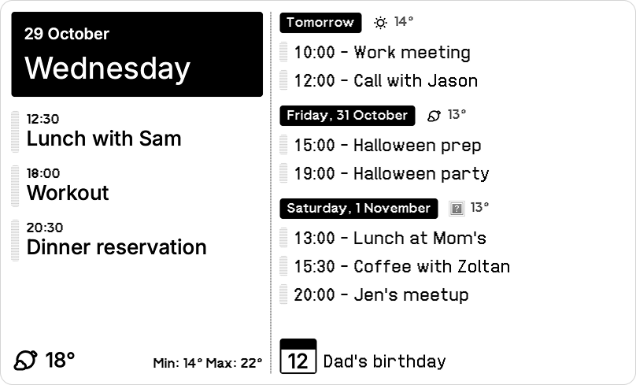

# TRMNL Calendar Dashboard
A custom calendar + weather plugin for TRMNL by Zoltán Hosszú.

This plugin loads data from a remote iCal calendar and Open Meteo's data for a given location, and displays a nice personal dashboard.

## Server side component
You need to upload the contents of the `server/` folder to your server.

Open `config.php` and configure your calendar URL, location, important events and locale settings.

## TRMNL Dashboard config
In TRMNL Dashboard's [Private Plugins page](https://usetrmnl.com/plugin_settings?keyname=private_plugin) add a new custom plugin.

Set the following:
- Strategy: Polling
- Polling URL(s): add the URL where you uploaded the contents of the `server/` folder
- You can leave the rest as per default

Name the plugin and then save it.

## TRMNL Markup
After you have saved the custom plugin, the **Edit Markup** button becomes available. Open and copy the `trmnl_markup.html` file's content and paste it into editor for the **Full** size.

The plugin currently doesn't support other sizes, but feel free to create a PR for other views.

## Attributions
This plugin uses [@seebz's iCal PHP gist](https://gist.github.com/seebz/c00a38d9520e035a6a8c) to decode and process iCal data. Thanks for that!